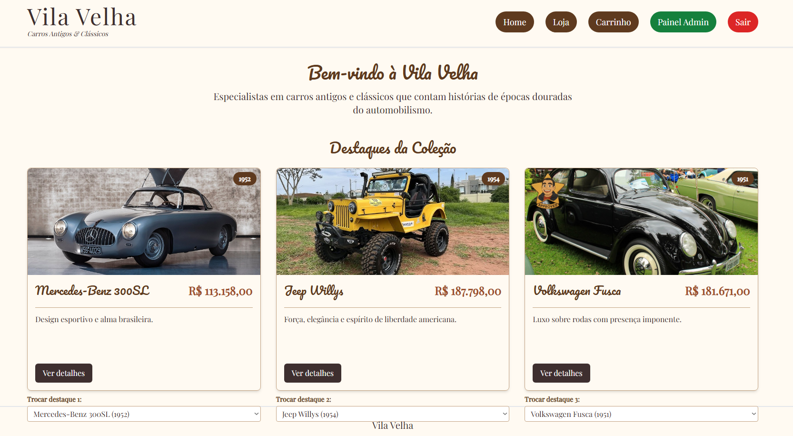

## Autores

- Adhemar Molon Neto - 14687681
- Luiz Fellipe Catuzzi - 11871198
- Pedro Lucas Figueiredo Bahiense - 14675458


# Projeto

O objetivo do projeto é criar uma pequena loja de carros, com as funcionalidades necessárias. Temos a funcionalidade de compra para os usuários do tipo cliente, e funcionalidades de edição. Sendo nosso site de venda de carros, nosso diferencial é um botão na descrição do carro que toca um áudio com o ronco do motor.


## Funcionalidades

- Home page com 3 carros na Vitrine
- Interface de Login
- Loja com diversos modelos
- Interface com detalhes do carro
- Inferface de compra com opções de pagamento variadas
- Painel Admin com informações de vendas (Exclusivo Admin)


## Demonstração

- Página inicial

- Carrinho de compras

- Tela de Login

- Página da Loja

- Página do pagamento

- Painel Administrador

## Rodando os testes

Para rodar os testes siga os seguintes passos:

1. Clone o Repositório

2. Instale as dependências

```bash
  npm install
```

3. Inicie o Servidor

```bash
  npm run dev
```
4.  O site estará disponivel num link como : http://localhost:xxxx/
## Testes realizados

  O modo admin permite que realizemos alterações nos 3 carros da página inicial, essa alteração fica salva no local Storage e se mantém quando saímos do modo admin e usar como usuário. Além disso as alterações feitas nos detalhes dos carros funcionaram também, mantendo as alterações (Descrição, estoque e preço) na loja.
## Desafios Enfrentados

  Foi necessário mudar um pouco a lógica das páginas para implementar o modo admin. Inicialmente tivemos a idéia das edições serem feitas numa página chamada "Painel Admin", mas ficou claro durante a implementação que editar dentro da página de detalhes era mais prático e intuitivo. 
## Considerações Finais

  Para esse milestone deixamos um login padrão para usuário admin e usuário normal, o que pode ser aprimorado para a avaliação final em que implementaremos um banco de dados que pode armazenar informações dos usuários.
